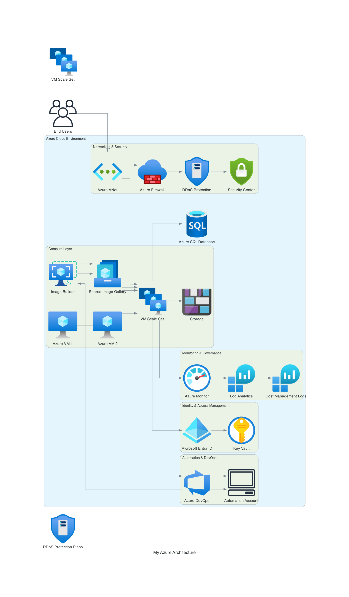

## Proposed Azure Cloud Architecture Solution
This architectural solution incorporates all the required components, ensuring scalability, security, automation, and cost efficiency in an Azure environment.

1. Architecture Overview
The proposed solution is a highly available, secure, and automated Azure cloud infrastructure, supporting various workloads while integrating networking, identity management, and Infrastructure as Code (IaC) for deployment automation.

2. Key Components & Design
   A. Compute Layer – Azure Virtual Machines (VMs) & Workload Customization
   Azure Virtual Machines (IaaS): Used for hosting critical applications and services.

   Custom VM Images: Built using Azure Image Builder to standardize workload configurations.

   Scaling Mechanisms: Azure Virtual Machine Scale Sets (VMSS) for automatic scaling.

   Backup & Disaster Recovery: Azure Backup & Site Recovery for data protection.

B. Networking & Security
   Azure Virtual Network (VNet): Securely connects all resources.

   Network Security Groups (NSGs) & Azure Firewall: Ensures controlled traffic flow and protection.

   Azure DDoS Protection: Mitigates potential attacks.

   ExpressRoute / VPN Gateway: Secure hybrid cloud connectivity if required.

C. Identity & Access Management (IAM)
   Microsoft Entra ID (formerly Azure Active Directory): Centralized authentication and access management.

   Azure Privileged Identity Management (PIM): Controls elevated permissions securely.

   Conditional Access Policies: Ensures zero-trust security principles.

D. Automation & Infrastructure as Code (IaC)
   Terraform / Bicep / ARM Templates: Infrastructure automation for consistent deployments.

   Azure DevOps CI/CD Pipelines: Automates application and infrastructure deployment.

   Azure Automation & Azure Functions: Automates recurring operational tasks.

E. Observability & Performance Monitoring
   Azure Monitor & Log Analytics: Provides real-time insights into system health.

   Application Insights: Monitors application-level performance.

   Azure Sentinel: Security Information and Event Management (SIEM) for threat detection.

F. Cost Optimization & Governance
   Azure Cost Management + Budgets: Monitors and controls cloud spending.

   Azure Policy & Blueprints: Enforces compliance with security and operational best practices.

# Business Benefits
✅ Scalability: Auto-scaling VMs with Azure Scale Sets.

✅ Security: Enforced access control with Microsoft Entra ID & Azure PIM.

✅ Automation: Fully automated deployments via IaC & CI/CD pipelines.

✅ Resilience: High availability with backups, disaster recovery, and monitoring.

✅ Cost Efficiency: Optimized infrastructure with Azure Cost Management & governance tools.

A conceptual diagram would illustrate the above components visually—showing connectivity between VMs, networking, security layers, identity management, and monitoring tools.

| Directory/File      | Description                                      |
|---------------------|--------------------------------------------------|
| `modules/`         | Contains reusable Terraform modules.             |
| `modules/networking/` | Networking resources (VPCs, Subnets, etc.).    |
| `modules/compute/` | Compute resources (VMs, Containers, etc.).       |
| `modules/security/` | Security components (IAM, Security Groups, etc.). |
| `environments/`    | Separate configurations for different environments. |
| `environments/dev/` | Development environment configuration.           |
| `environments/prod/` | Production environment configuration.           |
| `providers.tf`     | Defines provider configurations.                  |
| `terraform.tfvars` | Stores variable values (should be kept private).  |
| `backend.tf`       | Configures Terraform backend storage.             |
| `README.md`        | Documentation for the project.                    |

## Modules Explanation
- **`modules/`** - Contains reusable Terraform modules.
- **`environments/`** - Different environment configurations.
- **`providers.tf`** - Defines provider settings (Azure, AWS, etc.).
- **`terraform.tfvars`** - Stores variables (should be excluded from Git).

