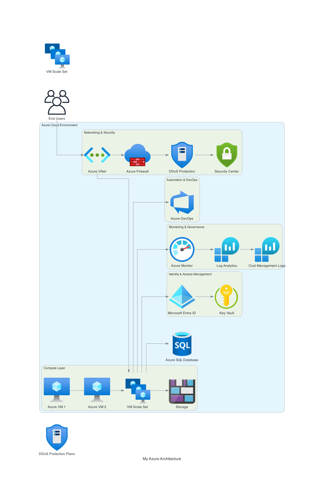

# Azure VM Images Management Infrastructure

This repository contains Terraform code to provision Azure infrastructure for VM image management, including networking, compute, security, monitoring, and optional image building capabilities.

## Proposed Azure Cloud Architecture Solution

This architectural solution incorporates all the required components, ensuring scalability, security, automation, and cost efficiency in an Azure environment.

## Architecture Overview

The proposed solution is a highly available, secure, and automated Azure cloud infrastructure, supporting various workloads while integrating networking, identity management, and Infrastructure as Code (IaC) for deployment automation.

## Key Components & Design

A. Compute Layer – Azure Virtual Machines (VMs) & Workload Customization
   Azure Virtual Machines (IaaS): Used for hosting critical applications and services.

   Custom VM Images: Built using Azure Image Builder to standardize workload configurations.

   Scaling Mechanisms: Azure Virtual Machine Scale Sets (VMSS) for automatic scaling.

   Backup & Disaster Recovery: Azure Backup & Site Recovery for data protection.

B. Networking & Security
   Azure Virtual Network (VNet): Securely connects all resources.

   Network Security Groups (NSGs) & Azure Firewall: Ensures controlled traffic flow and protection.

   Azure DDoS Protection: Mitigates potential attacks.

   ExpressRoute / VPN Gateway: Secure hybrid cloud connectivity if required.

C. Identity & Access Management (IAM)
   Microsoft Entra ID (formerly Azure Active Directory): Centralized authentication and access management.

   Azure Privileged Identity Management (PIM): Controls elevated permissions securely.

   Conditional Access Policies: Ensures zero-trust security principles.

D. Automation & Infrastructure as Code (IaC)
   Terraform / Bicep / ARM Templates: Infrastructure automation for consistent deployments.

   Azure DevOps CI/CD Pipelines: Automates application and infrastructure deployment.

   Azure Automation & Azure Functions: Automates recurring operational tasks.

E. Observability & Performance Monitoring
   Azure Monitor & Log Analytics: Provides real-time insights into system health.

   Application Insights: Monitors application-level performance.

   Azure Sentinel: Security Information and Event Management (SIEM) for threat detection.

F. Cost Optimization & Governance
   Azure Cost Management + Budgets: Monitors and controls cloud spending.

   Azure Policy & Blueprints: Enforces compliance with security and operational best practices.

## Business Benefits

✅ Scalability: Auto-scaling VMs with Azure Scale Sets.

✅ Security: Enforced access control with Microsoft Entra ID & Azure PIM.

✅ Automation: Fully automated deployments via IaC & CI/CD pipelines.

✅ Resilience: High availability with backups, disaster recovery, and monitoring.

✅ Cost Efficiency: Optimized infrastructure with Azure Cost Management & governance tools.

## Architecture Diagram

A conceptual diagram illustrates the above components visually—showing connectivity between VMs, networking, security layers, identity management, and monitoring tools.



## Directory Structure

| Directory/File                  | Description                                      |
|---------------------------------|--------------------------------------------------|
| `terrafrom/`                   | Contains Terraform configuration files.          |
| `terrafrom/modules/`           | Reusable Terraform modules for different components. |
| `terrafrom/modules/networking/`| Networking resources (VNet, Subnets, etc.).     |
| `terrafrom/modules/compute/`   | Compute resources (VMs, VMSS, etc.).             |
| `terrafrom/modules/security/`  | Security components (NSG, Key Vault, etc.).      |
| `terrafrom/modules/monitoring/`| Monitoring and observability resources.          |
| `terrafrom/modules/image-builder/` | Custom image building resources.              |
| `terrafrom/modules/automation/`| Automation account resources.                    |
| `terrafrom/modules/backup/`    | Backup resources.                                |
| `terrafrom/modules/cost/`      | Cost management resources.                       |
| `terrafrom/modules/iam/`       | Identity and access management.                  |
| `terrafrom/modules/observability/` | Additional observability tools.               |
| `images/`                      | Architecture diagrams and icons.                 |
| `main.py`                      | Python script for generating diagrams.            |
| `requirements.txt`             | Python dependencies.                              |
| `.github/`                     | GitHub Actions workflows.                         |
| `README.md`                    | Project documentation.                            |
| `terrafrom/provider.tf`        | Defines Azure provider configuration.             |
| `terrafrom/terraform.tfvars`   | Variable values for Terraform.                    |
| `terrafrom/variables.tf`       | Input variables definitions.                      |
| `terrafrom/main.tf`            | Main Terraform configuration.                     |
| `terrafrom/outputs.tf`         | Output values from Terraform.                     |
| `terrafrom/locals.tf`          | Local values for Terraform.                       |

## Modules Explanation

- **`terrafrom/modules/`** - Contains reusable Terraform modules for various Azure components.
- **`images/`** - Stores generated architecture diagrams.
- **`terrafrom/provider.tf`** - Defines provider settings for Azure.
- **`terrafrom/terraform.tfvars`** - Stores variables (should be excluded from Git).
- **`main.py`** - Script to generate architecture diagrams.

## Prerequisites

- Azure subscription
- Terraform >= 1.5.0
- GitHub repository with Actions enabled

## Setup

### 1. Clone the repository

```bash
git clone <repository-url>
cd azure-vm-images-mgmt
```

### 2. Configure Azure Credentials

Go to your GitHub repository settings > Secrets and variables > Actions, and add the following secrets:

- `AZURE_CREDENTIALS`: Azure service principal credentials in JSON format. You can create one using:

```bash
az ad sp create-for-rbac --name "github-actions-sp" --role contributor --scopes /subscriptions/<subscription-id> --sdk-auth
```

Copy the JSON output and paste it as the secret value.

### 3. Customize Configuration

Edit `terrafrom/terraform.tfvars` to match your requirements:

```hcl
environment = "dev"
project_name = "azure-vm-images-mgmt"
location = "West Europe"
# ... other variables
```

### 4. Enable Image Builder (Optional)

Set `enable_image_builder = true` in `terraform.tfvars` to enable custom image building.

## Usage

### Local Development

```bash
cd terrafrom
terraform init
terraform plan -var-file=terraform.tfvars
terraform apply -var-file=terraform.tfvars
```

### CI/CD Pipeline

The GitHub Actions workflows automatically:

- Validates Terraform configuration on pull requests
- Applies changes on push to main branch
- Builds custom VM images on manual trigger

#### Workflow Triggers

- **Pull Requests**: Runs format, validate, and plan
- **Push to main**: Runs full apply after validation
- **Manual Dispatch**: Allows manual triggering of the Terraform workflow
- **Image Builder**: Manually triggered to build and customize VM images using Azure Image Builder

#### Image Building Pipeline

The image building pipeline allows you to customize VM images with specific configurations, software installations, or security hardening. It uses Azure Image Builder to create reproducible images stored in a Shared Image Gallery.

To trigger the image build:
1. Go to the GitHub repository Actions tab
2. Select "Image Builder CI/CD" workflow
3. Click "Run workflow" (manual dispatch)
4. The pipeline will:
   - Apply Terraform infrastructure
   - Create and submit the image build job using Azure CLI
   - Wait for completion
   - Make the custom image available for VM deployment

## Outputs

After deployment, the following outputs are available:

- VNet and subnet details
- VM and NIC information
- Key Vault and NSG IDs
- Log Analytics workspace details
- Dashboard and monitoring extension info
- Image builder resources (if enabled)

## Security

- Randomly generated VM passwords stored in Key Vault
- NSG rules restrict SSH (port 22) and RDP (port 3389) access to the pipeline user's public IP only
- Key Vault network ACLs allow access only from the pipeline user's public IP
- Azure Monitor agent for comprehensive logging

## Contributing

1. Create a feature branch
2. Make changes
3. Submit a pull request
4. CI/CD will validate and plan the changes
5. Merge to main triggers deployment

## License

This project is licensed under the Apache License 2.0 - see the [LICENSE](LICENSE) file for details.
